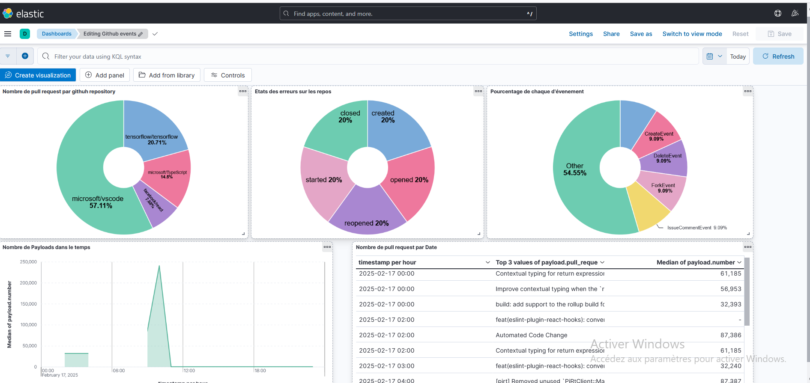

# Mini Projet Python, Docker, Elasticsearch & Kibana

## Prérequis
- Docker et Docker Compose installés
- Python 3 installé

## Installation
1. Cloner le projet :
   ```sh
   git clone https://github.com/ton-utilisateur/mon-projet.git
   cd mon-projet


